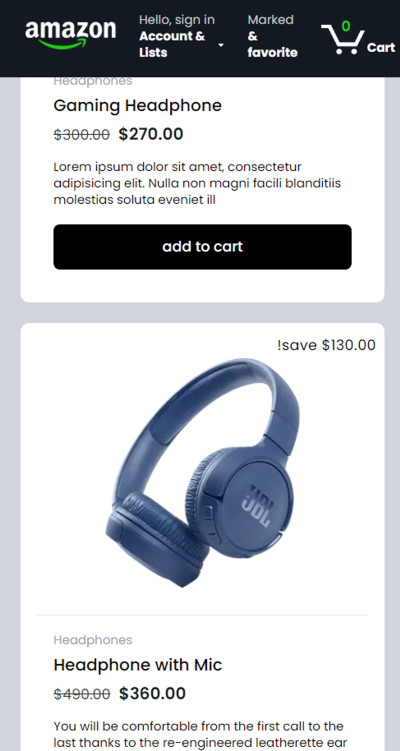

# Amazon Clone

This is a clone of the Amazon website using Next.js, Redux, Stripe, and NextAuth. It is a personal project that I created to showcase my web development skills and to learn new technologies. It has the following features and functionality:

- **Product showing and search**: Users can browse through a variety of products, Users can also search for products by title. They can also view the product details, such as the description, images, price, and discount.

- **Shopping cart and checkout**: Users can add or remove products from their shopping cart. They can also view the subtotal, tax, and shipping costs of their order. They can also proceed to checkout and enter their payment information using Stripe. They can also review their order summary and confirm their purchase.

- **User authentication**: Users can sign up, sign in, and sign out using their email and password or their Google or Github account. They can also view and edit their profile information, such as their name, email, and image. The authentication is handled by NextAuth, a library for server-side authentication with Next.js.

- **Payment processing**: Users can pay for their order using their credit or debit card. The payment is processed securely using Stripe API.

## Screen Shots

<!--  -->

#### main webpage

#### Cart page

#### favorite page

#### mobile size webpage

## Demo

You can view a live demo of the project [here]('https://amazon-clone-test.vercel.app/).

## Technologies

This project is built using the following technologies:

- **Next.js**: A React framework for building server-side rendered and static web applications
- **React**: A JavaScript library for building user interfaces
- **Redux toolkit**: A state management library.
- **Stripe**: A platform for online payment processing
- **NextAuth**: A library for server-side authentication with Next.js
- **Tailwind CSS**: A utility-first CSS framework for rapidly building custom designs

## Learning Outcomes

This project was a great opportunity for me to learn new technologies and improve my web development skills. Here are some of the things that I learned and the challenges that I overcame:

- **Next.js**: I learned how to use Next.js to create a server-side rendered and static web application. I also learned how to use Next.js features, such as dynamic routes, API routes, image optimization. I faced some challenges with configuring Next.js to work with NextAuth and Stripe, but I was able to solve them using environment variables and custom server middleware.

- **React**: I learned how to use React hooks, props, state, and integration with redux to create a dynamic and interactive user interface. I faced some challenges with managing the state of the app and passing data between components, but I was able to solve them using the Redux Toolkit.

- **Redux**: I learned how to create store, slices, reducers and actions then make them interactive by using useSelector and useDispatch to achieve single way of truth by passing action and receive an updated state.

- **Stripe**: I learned how to use Stripe to process online payments and create secure checkout experiences. I faced some challenges with integrating Stripe with Next.js, but I was able to solve them using Strip documentation.

- **NextAuth**: I learned how to use NextAuth to implement server-side authentication with Next.js. I also learned how to use NextAuth providers, callbacks, sessions, and pages to customize the authentication flow and the user experience.

- **Tailwind CSS**: I learned how to use Tailwind CSS to create a responsive and modern design for the app. I also learned how to use Tailwind utilities, and custom classes to style the app. I faced some challenges with overriding the default styles, but I was able to solve them using Tailwind configuration and keyframes.

## License

This project is licensed under the MIT License. See the LICENSE file for more details.

## Acknowledgements

This project is inspired by the Amazon website and the tutorial by reactbd . I also used some icons from React icon and some images from Unsplash.
